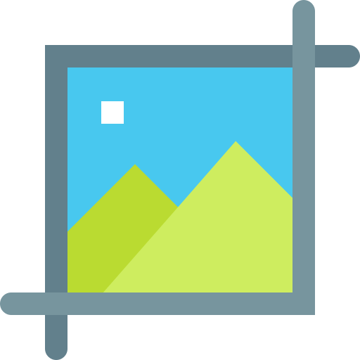
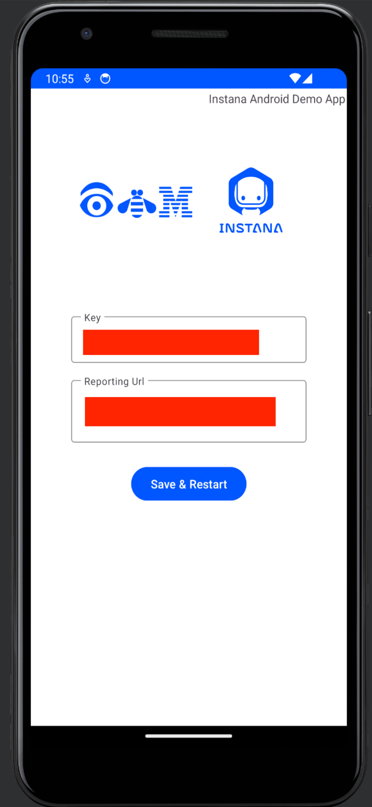
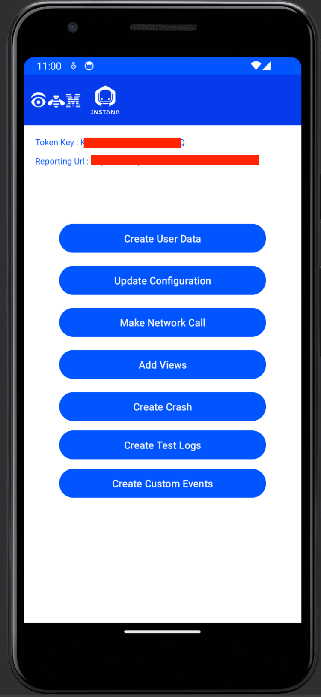
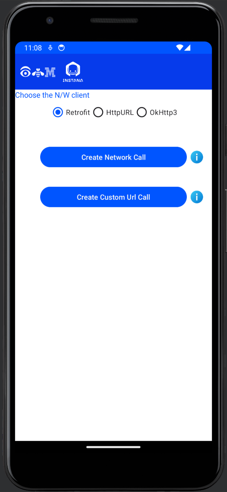
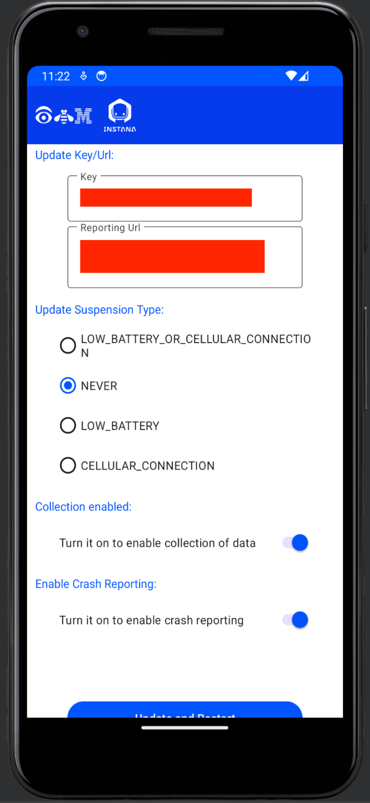
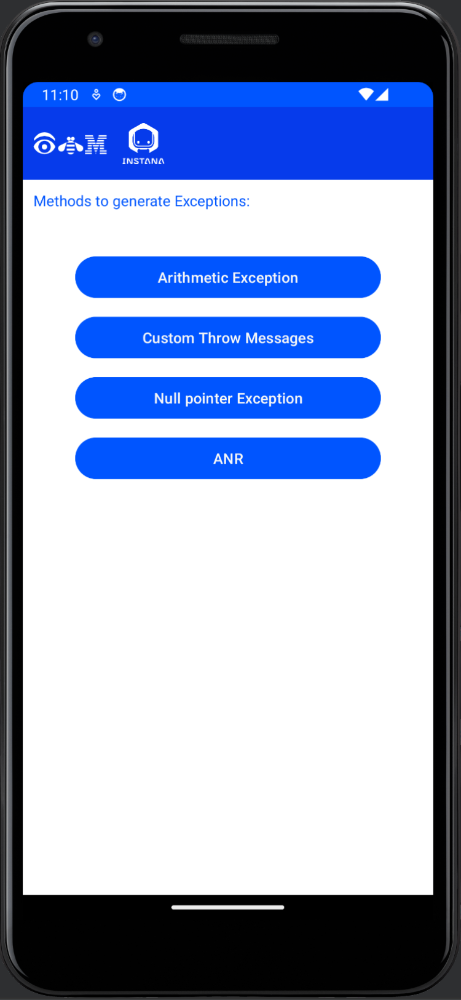
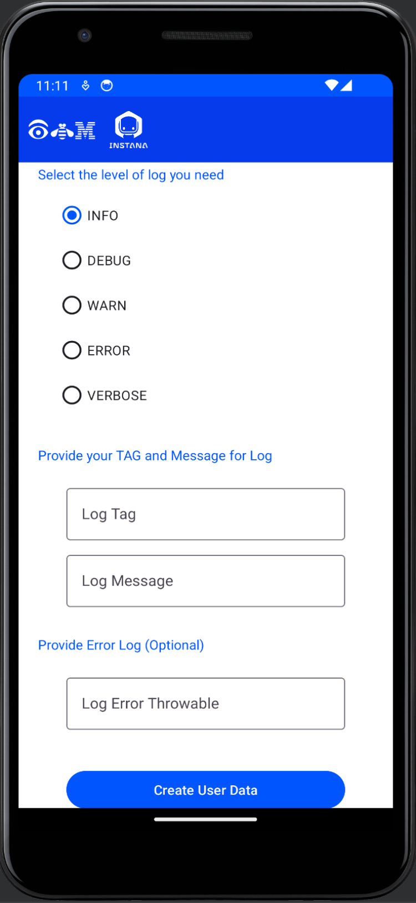
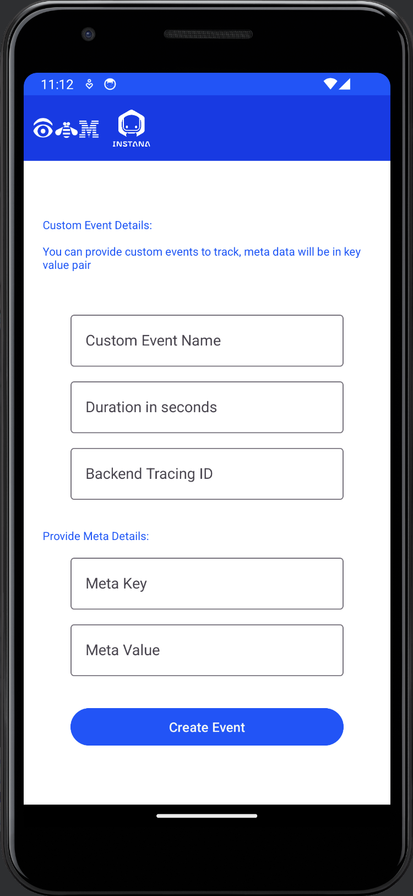
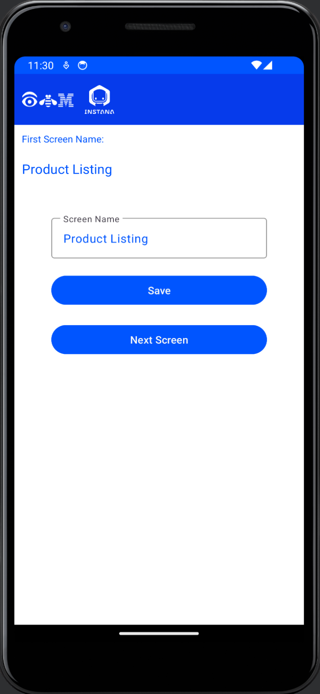
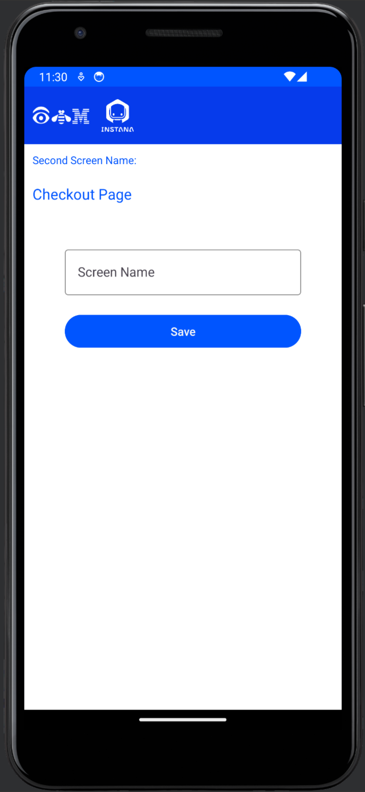

# IBM-Instana-Demo

A demo application for understanding the features & capabilities of IBM Instana Android Agent.

## Features Identified

- ***Runtime update of reporting URL & Instana Key***: Dynamically configure the reporting URL and Instana key within the application at runtime, allowing flexibility and easy management.

- ***Create/Update User Data - mocking user login***: Simulate user login to update user data and ensure accurate tracking of identified users. The information provided will be reflected in the identified user list.

- ***Update Instana configuration in runtime***: Update the Instana configuration on-the-fly, including the reporting URL and key, without requiring a restart. This allows for seamless adjustments to the Instana integration.

- ***Make network calls based on the identified Network client***: Utilize the different network clients supported by the Instana Android Agent to make network calls and monitor network performance. Test and analyze your app's behavior under various network scenarios.

- ***Add View functionality to identify the pages/views visited by the user***: Implement view tracking to gain insights into the user's navigation patterns within the app. Monitor and analyze which pages or views are most frequently visited by users.

- ***Create crashes for reporting***: Generate crashes and exceptions within the app to test the crash reporting feature of Instana. Explore different scenarios and ensure accurate crash reporting in the Instana dashboard.

- ***Test Logs with customizable log levels***: Log developer-defined data with customizable log levels, allowing detailed debugging and analysis. Capture and review relevant information based on the selected log level.

- ***Custom events reporting***: Generate and report custom events within the app. Associate custom event names with metadata to provide meaningful insights in the Instana dashboard. Track specific user actions or milestones using custom event reporting.

> **Note:** These features are designed to showcase the capabilities of IBM Instana Android Agent and provide a comprehensive understanding of its functionality.

For more information and detailed documentation, visit the [IBM Instana](https://www.ibm.com/products/instana) official website. Additionally, you can refer to the [Android Agent API documentation](https://www.ibm.com/docs/en/instana-observability/current?topic=monitoring-android-api) for detailed information about the Instana Android Agent API.

🎉 **Get started with IBM Instana and explore the power of real-time monitoring and analytics in your Android applications!**

  

        <table style="margin-left: auto; margin-right: auto; ">
            <tr>
                <td align="center">
                    
                </td>
                <td align="center">
                    Screen Captures
                </td>
          </tr>
        </table>
  

   
  

    <table style="margin-left: auto; margin-right: auto; ">
      <tr>
        <td align="center">
          <b>
Credentials Screen - onetime
</b>
        </td>
        <td align="center">
          <b>
Feature Listing Screen
</b>
        </td>
        <td align="center">
          <b>
User Data Screen
</b>
        </td>
        <td align="center">
          <b>
Network Request Screen
</b>
        </td>
        <td align="center">
          <b>
Instana Configuration Screen
</b>
        </td>
      </tr>
      <tr>
        <td align="center">
          
        </td>
        <td align="center">
          
        </td>
        <td align="center">
          
        </td>
        <td align="center">
          
        </td>
        <td align="center">
          
        </td>
      </tr>
    </table>
  

  

    <table style="margin-left: auto; margin-right: auto; ">
      <tr>
       <td align="center">
          <b>
Instana Crash Generate Screen
</b>
        </td>
        <td align="center">
          <b>
Generate Logs Screen
</b>
        </td>
        <td align="center">
          <b>
Custom Events Screen
</b>
        </td>
        <td align="center">
          <b>
View Test Screen1
</b>
        </td>
        <td align="center">
          <b>
View Test Screen2
</b>
        </td>
      <tr>
        <td align="center">
          
        </td>
        <td align="center">
          
        </td>
        <td align="center">
          
        </td>
        <td align="center">
          
        </td>
        <td align="center">
          
        </td>
      </tr>
    </table>
  

    

        

            <table style="margin-left: auto; margin-right: auto; ">
                <tr>
                    <td align="center">
                        
                    </td>
                    <td align="center">
                        Brief descriptions on each screens
                    </td>
                </tr>
            </table>
        

<table style="margin-left: auto; margin-right: auto; ">
    <tr>
        <td align="center">
          <b>
Initial Setup Screen
</b>
        </td>
        <td align="center">
            
This screen will be displayed to the user for the first time to set up the reporting URL and the key obtained from the dashboard. Once the user saves the data, the application class will be recreated.

        </td>
    </tr>
    <tr>
        <td align="center">
          <b>
Feature Listing Screen
</b>
        </td>
        <td align="center">
            
This is the home screen where all the available features of the Android Instana Agent are showcased. The user can select any feature to test. To ensure the correct key is provided, the collected key and URL are displayed at the top.

        </td>
    </tr>
    <tr>
        <td align="center">
          <b>
User Data Screen
</b>
        </td>
        <td align="center">
            
This screen displays the user's profile or user details. It simulates user login to update the identified user list based on the provided data. The info button at the top provides these details to the user.

        </td>
    </tr>
    <tr>
        <td align="center">
          <b>
Network Request Screen
</b>
        </td>
        <td align="center">
            
On this page, the user can make network calls using the selected network client. The Instana Android Agent supports three clients for monitoring, which have been added for ease of testing. The user can enter a URL for a demo link or provide their own URL to be called using the custom URL option.

        </td>
    </tr>
    <tr>
        <td align="center">
          <b>
Instana Configuration Screen
</b>
        </td>
        <td align="center">
            
This is the base page for updating the configuration of Instana at runtime. The user can change the reporting URL and key to report to another Instana dashboard or instance. Applying the changes requires restarting the activity.

        </td>
    </tr>
    <tr>
        <td align="center">
          <b>
Instana Crash Generation Screen
</b>
        </td>
        <td align="center">
            
On this screen, the user can generate various types of exceptions and crashes. They can even generate a custom message crash for a RuntimeException and check the crash reporting in the dashboard.

        </td>
    </tr>
    <tr>
        <td align="center">
          <b>
Generate Logs Screen
</b>
        </td>
        <td align="center">
            
Using this screen, the user can provide custom logs for reporting, including the desired log level. They can select the available options to create a log tag and message. For error throwables, there is an optional field available.

        </td>
    </tr>
    <tr>
        <td align="center">
          <b>
Custom Events Screen
</b>
        </td>
        <td align="center">
            
On this screen, the user can create custom events with custom event names and associated metadata. These events will be shown on the dashboard along with a backend tracking ID.

        </td>
    </tr>
    <tr>
        <td align="center">
          <b>
View Test Screen 1 & Screen 2
</b>
        </td>
        <td align="center">
            
These screens are used for tracking views. In the first screen, the user can provide a name, such as "Product Listing" (an example name is provided). Similarly, the second screen allows the user to update the name, for example, "Checkout Page". This enables tracking of the views visited by the user based on the provided names in the dashboard.

        </td>
    </tr>
</table>
    

