# 🚀 Awesome Sample Apps For Android

## Applications
- [RobotShop Mobile Application](#robotshop-mobile-application)
    - This is a sample e-commerce application instrumented with Instana.
- [API Showcase Application](#android-api-showcase)
    - Example mobile application designed to showcase and test the capabilities of IBM Instana Android Agent and provide a comprehensive understanding of its functionality.
- [Crash Collection User Consent](#crash-collection-user-consent)
    - Example mobile application designed to showcase crash collection using Instana Android Agent with user consent.

---

## Robotshop Mobile Application 

A Shopping application instrumented with <a href="https://github.com/instana/android-agent" target="_blank">Instana android agent</a>.

> **Note:** For running this application, you must setup and run the EUM backend at port 8081

##### App Specification

- App uses `Version Catalog` for adding dependency
- Uses Android clean architecture 
- Uses Compose based UI
- Language : Kotlin

##### Special/New features used from agent

- Autocapture screen name for Compose UI
- Custom Metric with custom events

##### App Features

- Set/Update reporting URL and key ar runtime from app's `settings` screen
- User Details will be saved if you provide details in `signup` screen
- Change version of API called at runtime from the `settings` screen V1/V2
- Crash will occure if you add a non numeric value in filter of price range [Crash reporting analysis]
- Crashes when you call the API for discount with v1 version. [API Response structure changed]
- Can collect sales done over a particular period using custom metric filter. Custom Event details:
    - `'payment_success'` : Amount paid Successfully
    - `'reached_payment'` : Number of people reached payment page
    - `'payment_done_count'` : Number of people done payment
    - `'Login_Success'`   : Number of login success count

##### Screenshots

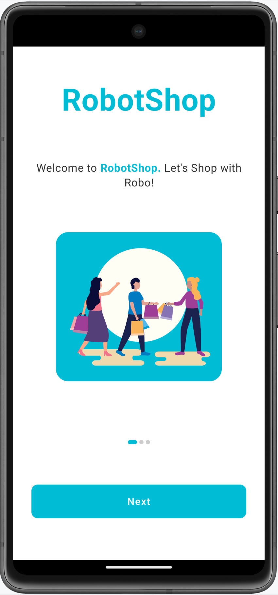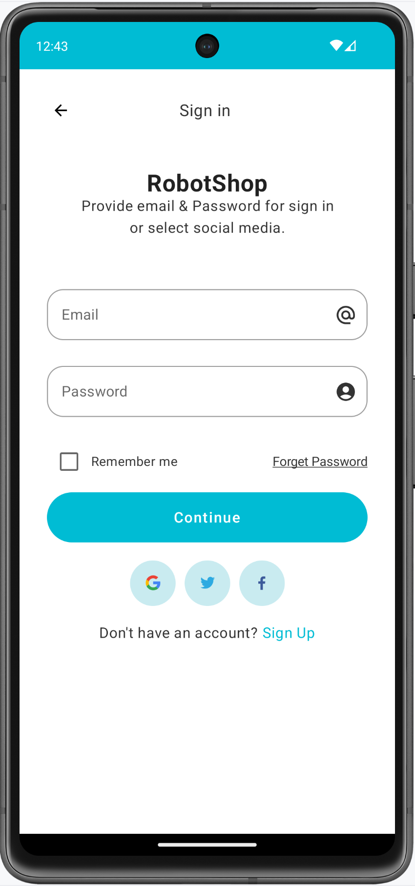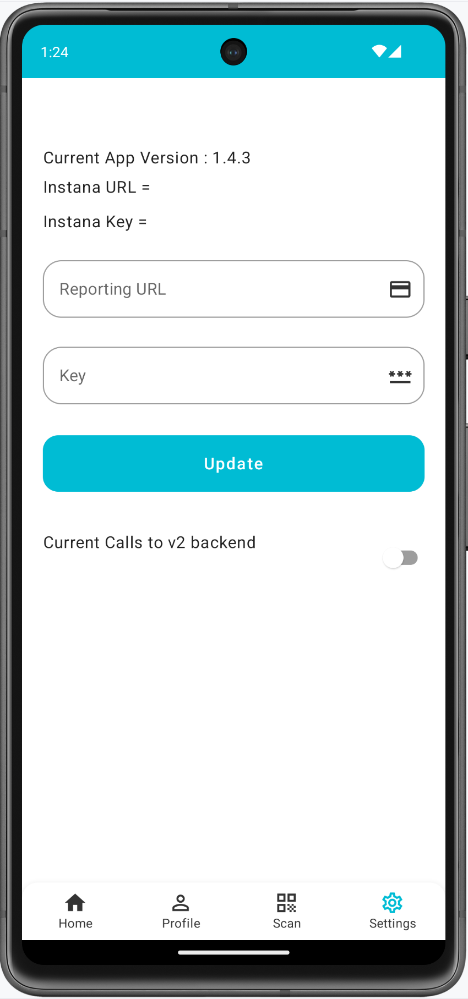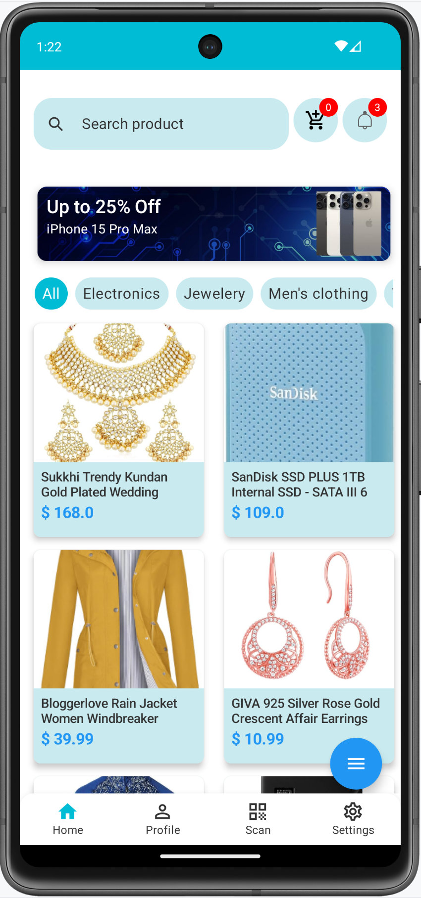 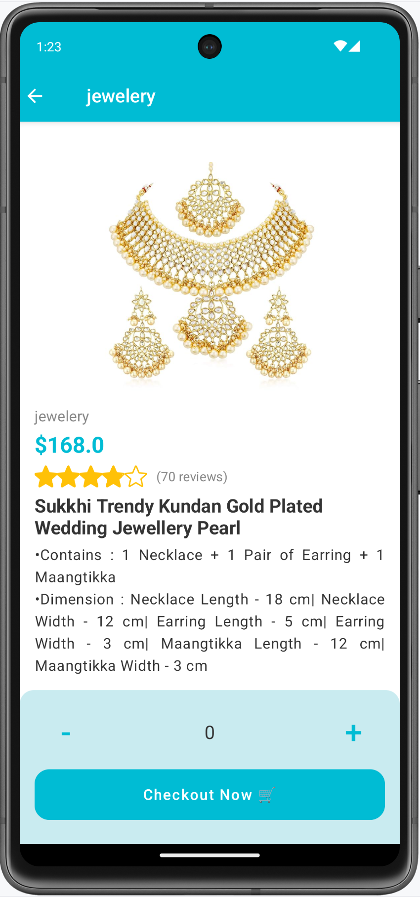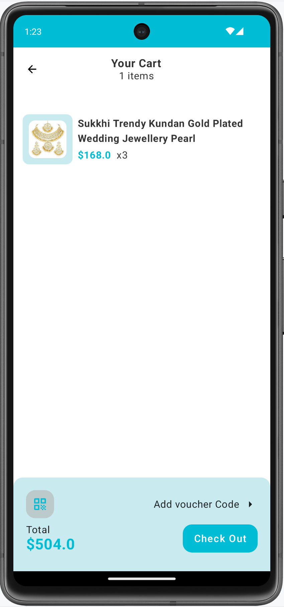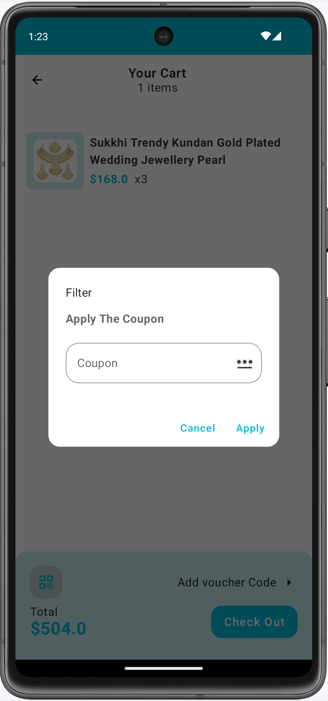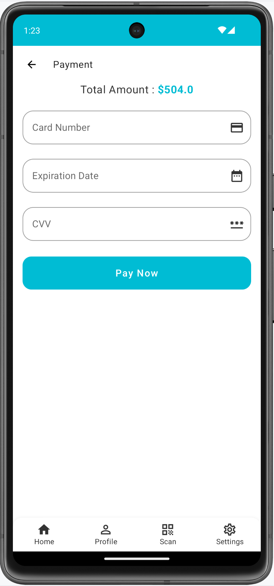

##### Applicaion Link

You can download this application ☞
<button onclick="window.open('https://download-directory.github.io/?url=https://github.com/instana/awesome-eum/tree/master/android-compose-robotshop', '_blank')" style="background-color: #157878; color: white; padding: 10px 20px; border: none; cursor: pointer; border-radius: 4px;">Download Folder</button>

The Application repository ☞ <a href="https://github.com/instana/awesome-eum/tree/master/android-compose-robotshop" target="_blank">here</a>.

---

## Android Api Showcase

Example mobile application designed to showcase and test the capabilities of IBM Instana Android Agent and provide a comprehensive understanding of its functionality.

##### App Specification

- App uses `build.gradle` file for adding dependency
- Instana android-agent version 6.0.4 is used
- Language : Kotlin

##### App Features

- ***Runtime update of reporting URL & Instana Key***: Dynamically configure the reporting URL and Instana key within the application at runtime, allowing flexibility and easy management.

- ***Create/Update User Data - mocking user login***: Simulate user login to update user data and ensure accurate tracking of identified users. The information provided will be reflected in the identified user list.

- ***Update Instana configuration in runtime***: Update the Instana configuration on-the-fly, including the reporting URL and key, without requiring a restart. This allows for seamless adjustments to the Instana integration.

- ***Make network calls based on the identified Network client***: Utilize the different network clients supported by the Instana Android Agent to make network calls and monitor network performance. Test and analyze your app's behavior under various network scenarios.

- ***Add View functionality to identify the pages/views visited by the user***: Implement view tracking to gain insights into the user's navigation patterns within the app. Monitor and analyze which pages or views are most frequently visited by users.

- ***Create crashes for reporting***: Generate crashes and exceptions within the app to test the crash reporting feature of Instana. Explore different scenarios and ensure accurate crash reporting in the Instana dashboard.

- ***Test Logs with customizable log levels***: Log developer-defined data with customizable log levels, allowing detailed debugging and analysis. Capture and review relevant information based on the selected log level.

- ***Custom events reporting***: Generate and report custom events within the app. Associate custom event names with metadata to provide meaningful insights in the Instana dashboard. Track specific user actions or milestones using custom event reporting.

> **Note:** These features are designed to showcase the capabilities of IBM Instana Android Agent and provide a comprehensive understanding of its functionality.

For more information and detailed documentation, visit the <a href="https://www.ibm.com/products/instana" target="_blank">IBM Instana</a> official website. Additionally, you can refer to the <a href="https://www.ibm.com/docs/en/instana-observability/current?topic=monitoring-android-api" target="_blank">Android Agent API documentation</a> for detailed information about the Instana Android Agent API.

##### Screenshots

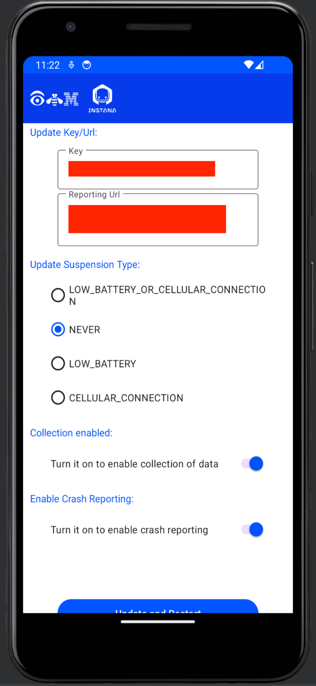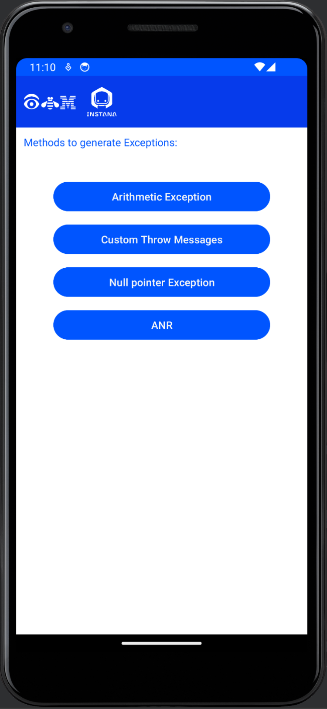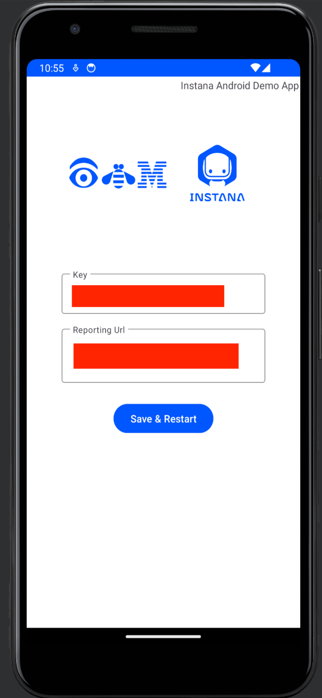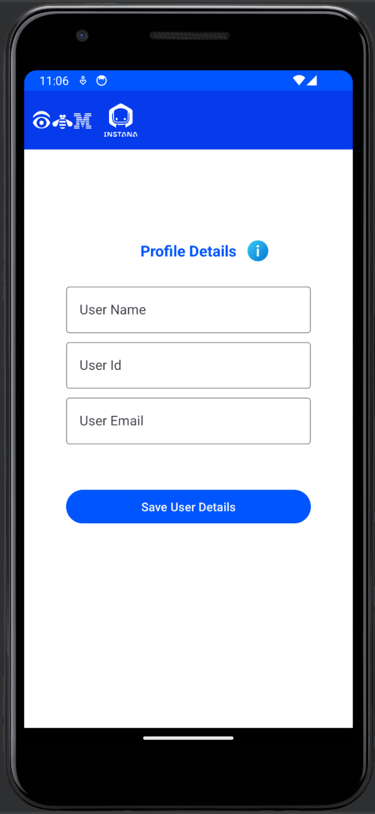 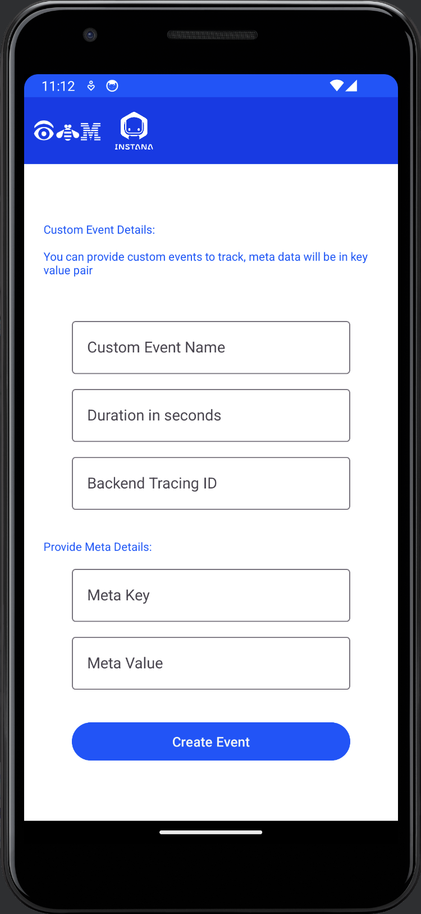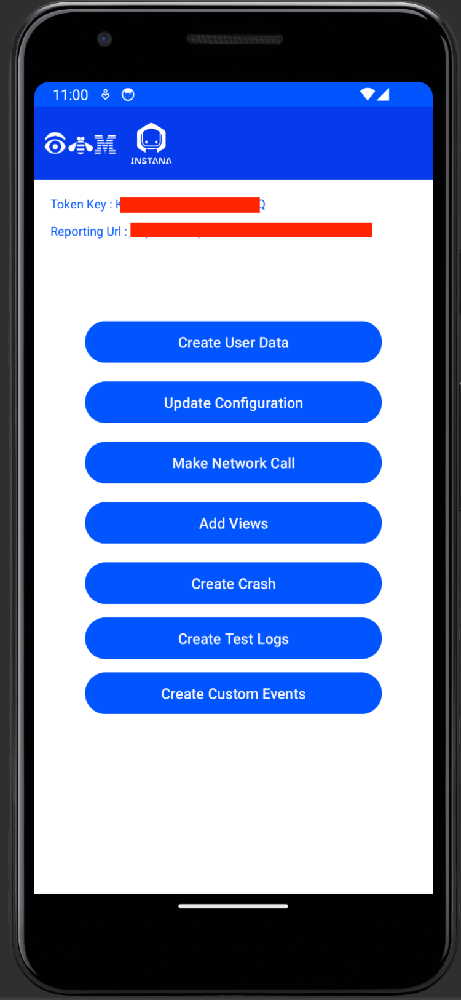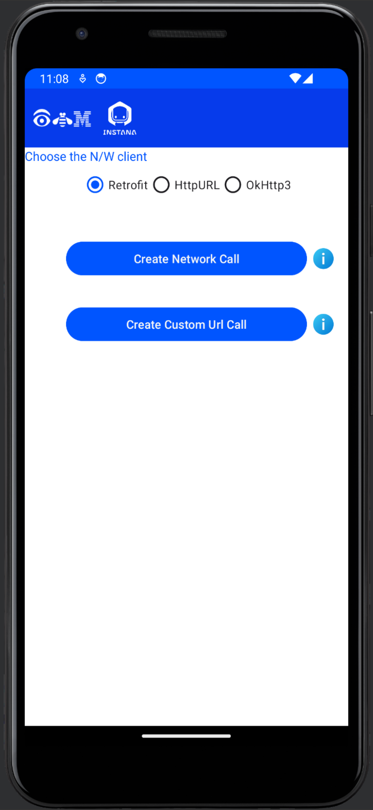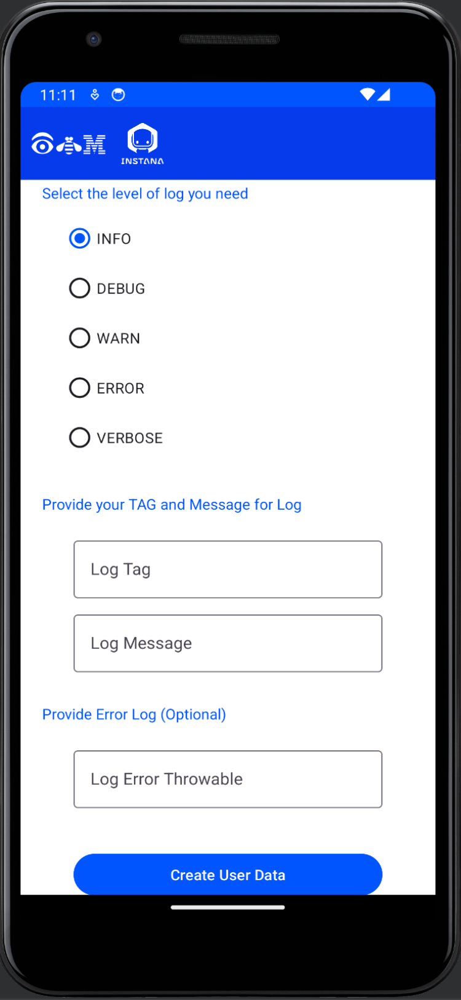

##### Applicaion Link

You can download this application ☞
<button onclick="window.open('https://download-directory.github.io/?url=https://github.com/instana/awesome-eum/tree/master/android-api-showcase', '_blank')" style="background-color: #157878; color: white; padding: 10px 20px; border: none; cursor: pointer; border-radius: 4px;">Download Folder</button>

The Application repository ☞ <a href="https://github.com/instana/awesome-eum/tree/master/android-api-showcase" target="_blank">here</a>.

 ---

## Crash Collection User Consent

Example mobile application designed to showcase crash collection using Instana Android Agent with user consent.

This app showcases the simplest use case of the Instana Android Agent in an Android app written using:
- Kotlin
- Coroutines
- OkHttp3

##### Compiling

Open [ExampleApp.kt](https://github.com/instana/awesome-eum/blob/master/android-crash-user-consent/app/src/main/java/com/instana/android/example/ExampleApp.kt) and replace these two values with your own (obtained in your Instana Dashboard): 
1. `REPORTING_URL`
2. `KEY`

Compile as usual using Android Studio 3.x

##### Structure

- Instana dependencies in [project-level gradle.build](https://github.com/instana/awesome-eum/blob/master/android-crash-user-consent/build.gradle)
- Instana plugin and dependencies in [module-level gradle.build](https://github.com/instana/awesome-eum/blob/master/android-crash-user-consent/app/build.gradle)
- Minimal initialization of Instana Agent in [ExampleApp.kt](https://github.com/instana/awesome-eum/blob/master/android-crash-user-consent/app/src/main/java/com/instana/android/example/ExampleApp.kt)
- Set view name in `onResume()` in [MainActivity.kt](https://github.com/instana/awesome-eum/blob/master/android-crash-user-consent/app/src/main/java/com/instana/android/example/MainActivity.kt)
- OkHttp3 and coroutines to execute a single query which Instana automatically tracks

##### Screenshots

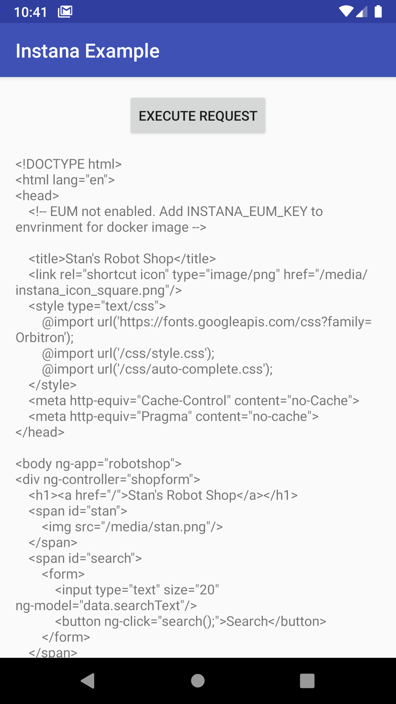

##### Applicaion Link

You can download this application ☞
<button onclick="window.open('https://download-directory.github.io/?url=https://github.com/instana/awesome-eum/tree/master/android-crash-user-consent', '_blank')" style="background-color: #157878; color: white; padding: 10px 20px; border: none; cursor: pointer; border-radius: 4px;">Download Folder</button>

The Application repository ☞ <a href="https://github.com/instana/awesome-eum/tree/master/android-crash-user-consent" target="_blank">here</a>.