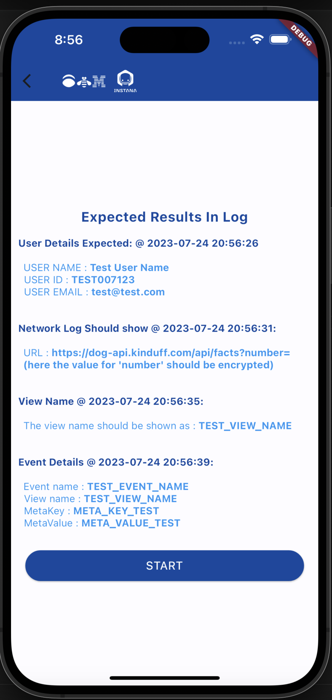

# 🚀 Awesome Sample Apps For Flutter

## Applications
- [RobotShop Mobile Application](#robotshop-mobile-application)
    - This is a sample e-commerce application instrumented with Instana.

 ---

## Flutter Api Showcase

Example mobile application designed to showcase and test the capabilities of IBM Instana Flutter Agent and provide a comprehensive understanding of its functionality.

##### App Features

- ***Runtime update of reporting URL & Instana Key***: Dynamically configure the reporting URL and Instana key within the application at runtime, allowing flexibility and easy management.

- ***Create/Update User Data - mocking user login***: Simulate user login to update user data and ensure accurate tracking of identified users. The information provided will be reflected in the identified user list.

- ***Update Instana configuration in runtime***: Update the Instana configuration on-the-fly, including the reporting URL and key, without requiring a restart. This allows for seamless adjustments to the Instana integration.

- ***Make network calls based on the identified Network client***: Instana Flutter Agent make network calls and monitor network performance. Test and analyze your app's behavior under various network scenarios with custom urls.

- ***Add View functionality to identify the pages/views visited by the user***: Implement view tracking to gain insights into the user's navigation patterns within the app. Monitor and analyze which pages or views are most frequently visited by users.

- ***Custom events reporting***: Generate and report custom events within the app. Associate custom event names with metadata to provide meaningful insights in the Instana dashboard. Track specific user actions or milestones using custom event reporting.

- ***Run All At Once***: This feature enables testing all the aforementioned features with a single click. At the end of the process, we will obtain the expected result set with timestamp, which we can review on the Instana dashboard to confirm if everything is functioning properly or not.

> **Note:** These features are designed to showcase the capabilities of IBM Instana Flutter Agent and provide a comprehensive understanding of its functionality.

For more information and detailed documentation, visit the <a href="https://www.ibm.com/products/instana" target="_blank">IBM Instana</a> official website. Additionally, you can refer to the <a href="https://www.ibm.com/docs/en/instana-observability/current?topic=monitoring-flutter-api" target="_blank">Flutter Agent API documentation</a> for detailed information about the Instana Flutter Agent API.

🎉 **Get started with IBM Instana and explore the power of real-time monitoring and analytics in your Flutter applications!**

##### Screenshots

##### Applicaion Link TODO::Upldate link

You can download this application ☞
<button onclick="window.open('https://download-directory.github.io/?url=https://github.com/instana/flutter-agent/tree/main/lib', '_blank')" style="background-color: #157878; color: white; padding: 10px 20px; border: none; cursor: pointer; border-radius: 4px;">Download Folder</button>

The Application repository ☞ <a href="https://github.com/instana/flutter-agent/tree/main/lib" target="_blank">here</a>.

 ---