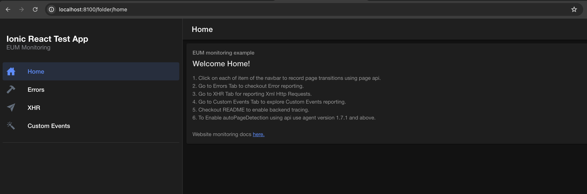
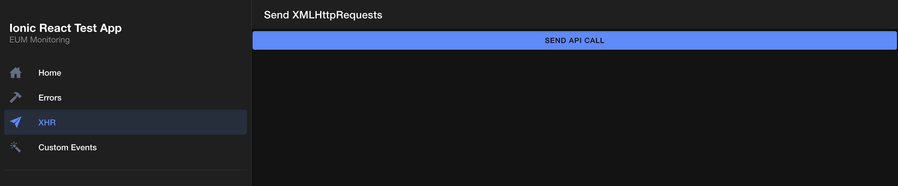

# 🚀 Awesome Sample Apps For Weasel

## Applications
- [Ionic Web Application](#ionic-web-application)
    - This is a sample ionic web application instrumented with Instana Weasel agent

---

## Ionic Web Application

An Ionic application showcasing Instana Weasel agent capabilities. 

##### App Specification

- Collecting XHR data
- Capturing js errors
- Sending Custom events
- capturing page names and more

##### Set up ionic app monitored by Instana JavaScript Agent

###### Set up a basic ionic app
- `npm install -g @ionic/cli` to install commandline 
- `ionic start`
- Select No on Do you want to use app creation wizard
- Select the desired framework (Angular, React, Vue) and give a project name
- Choose any one of the app starting templates

###### Run the app and instrument with Instana
- `cd app-dir`
- Run `ionic serve`
- Instrument the index.html file with weasel monitoring script

The application will run on port `8100`

##### Enable backend tracing

- Install instana agent on host machine and ensure configuration is set to `enable tracing`.
- Set up a server in the host machine.
- cd app-dir 
- Run `ionic build --prod` to build the project
- Copy the directory `dist` to your server. 
- In the configuration of your server, add a path to the dist directory and designate a listening port. 
- The application will now run on the specified port and backend trace will be visible on Instana Dashboard. 
FooterIBM - Office of the CIO
IBM - Office of the CIO

##### Screenshots

      

##### Applicaion Link //TODO::Replace link

You can download this application ☞
<button onclick="window.open('https://download-directory.github.io/?url=https://github.com/instana/flutter-agent/tree/main/lib', '_blank')" style="background-color: #157878; color: white; padding: 10px 20px; border: none; cursor: pointer; border-radius: 4px;">Download Folder</button>

The Application repository ☞ <a href="https://github.com/instana/flutter-agent/tree/main/lib" target="_blank">here</a>.

---

