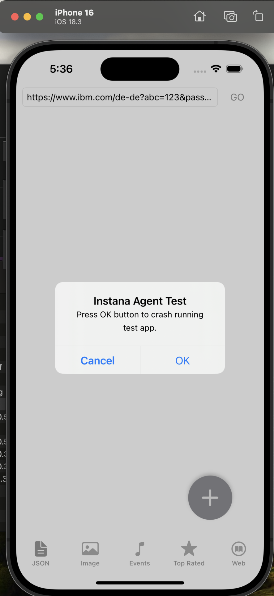

# InstanaAgentExample

This is a test app for iosAgent framework testing.

- iOS version 13.0 or above is fully supported.
- There is very limited support for iOS versions below 13.0. The main purpose is to test crash catching, make sure it's disabled.
- If run on device, replace test bundle id com.instana.ios.InstanaAgentExample with a real one otherwise certain features like crash catching will not work.

## Compiling

Open [Config.swift](InstanaAgentExample/Config.swift) and replace these two values with your own (obtained in your Instana Dashboard): 
1. `INSTANA_REPORTING_KEY`
2. `INSTANA_REPORTING_URL`

## Crash Test

To send a crash:
- Run the application on a real device, replace the test id com.instana.ios.InstanaAgentExample with a real one.
- Navigate to the 'JSON' tab. 
- Click the '+' icon to generate a crash.

